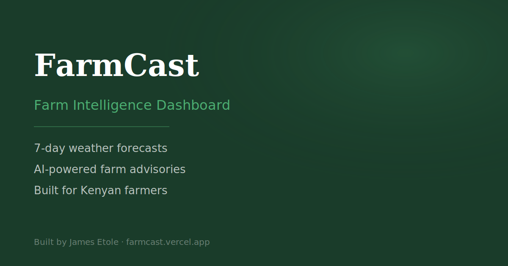

# 🌱 FarmCast — Farm Intelligence Dashboard

> 7-day weather forecasts paired with AI-powered farm advisories for Kenyan farmers.
> Built by [James Etole](https://www.linkedin.com/in/james-etole-6a7115145/)



## Live Demo

🔗 **[farmcast-zeta.vercel.app](https://farmcast-zeta.vercel.app)**

---

## What It Does

FarmCast is a farm intelligence dashboard that helps Kenyan farmers make
data-driven decisions about their land. A farmer types any location in Kenya,
and FarmCast returns:

- **7-day weather forecast** — temperature, precipitation, wind speed per day
- **Hourly breakdown** — click any day card to see an hourly chart (temperature curve, precipitation bars, wind speed)
- **AI farm advisory** — Groq AI analyses the forecast and returns specific advice on planting windows, irrigation needs, risk warnings, and the best days to work the farm

---

## Tech Stack

| Layer | Technology | Why |
|---|---|---|
| Framework | Next.js 14 (App Router) | SSR, API routes, file-based routing |
| Language | TypeScript | Type safety across the whole codebase |
| Styling | CSS custom properties + inline styles | Design token system, dark/light theme |
| Weather API | [Open-Meteo](https://open-meteo.com/) | Free, no API key, global coverage |
| AI | [Groq](https://groq.com/) — Llama 3.3 70B | Free tier, fast inference, no credit card |
| Charts | [Recharts](https://recharts.org/) | Composable React charts |
| Fonts | Inter + Fraunces (Google Fonts) | Clean UI + organic serif for brand |
| Deployment | [Vercel](https://vercel.com/) | Native Next.js hosting, zero config |
| PWA | next-pwa | Installable from Chrome, offline capable |

---

## Architecture
# 🌱 FarmCast — Farm Intelligence Dashboard

> 7-day weather forecasts paired with AI-powered farm advisories for Kenyan farmers.
> Built by [James Etole](https://www.linkedin.com/in/james-etole-6a7115145/)


## Live Demo

🔗 **[farmcast-zeta.vercel.app](https://farmcast-zeta.vercel.app)**

---

## What It Does

FarmCast is a farm intelligence dashboard that helps Kenyan farmers make
data-driven decisions about their land. A farmer types any location in Kenya,
and FarmCast returns:

- **7-day weather forecast** — temperature, precipitation, wind speed per day
- **Hourly breakdown** — click any day card to see an hourly chart (temperature curve, precipitation bars, wind speed)
- **AI farm advisory** — Groq AI analyses the forecast and returns specific advice on planting windows, irrigation needs, risk warnings, and the best days to work the farm

---

## Tech Stack

| Layer | Technology | Why |
|---|---|---|
| Framework | Next.js 14 (App Router) | SSR, API routes, file-based routing |
| Language | TypeScript | Type safety across the whole codebase |
| Styling | CSS custom properties + inline styles | Design token system, dark/light theme |
| Weather API | [Open-Meteo](https://open-meteo.com/) | Free, no API key, global coverage |
| AI | [Groq](https://groq.com/) — Llama 3.3 70B | Free tier, fast inference, no credit card |
| Charts | [Recharts](https://recharts.org/) | Composable React charts |
| Fonts | Inter + Fraunces (Google Fonts) | Clean UI + organic serif for brand |
| Deployment | [Vercel](https://vercel.com/) | Native Next.js hosting, zero config |
| PWA | next-pwa | Installable from Chrome, offline capable |

---

## Architecture
src/

├── app/

│   ├── api/

│   │   └── advisory/

│   │       └── route.ts        # Server-side Groq API route

│   ├── globals.css             # Design tokens (light + dark mode)

│   ├── layout.tsx              # Root server layout — SEO metadata, fonts

│   ├── page.tsx                # Server Component — nav, footer, shell

│   ├── sitemap.ts              # Auto-generated sitemap.xml

│   └── robots.ts               # Auto-generated robots.txt

├── components/

│   ├── DashboardClient.tsx     # Client Component — all interactive state

│   ├── SearchBar.tsx           # Debounced search with location suggestions

│   ├── WeatherPanel.tsx        # 7-day forecast grid

│   ├── WeatherCard.tsx         # Single day card — clickable for hourly chart

│   ├── HourlyChartModal.tsx    # Modal with Recharts hourly breakdown

│   ├── AdvisoryPanel.tsx       # AI farm advisory display

│   ├── ThemeToggle.tsx         # Dark/light mode toggle

│   ├── LinkedInButton.tsx      # Isolated client component for hover effect

│   └── ErrorMessage.tsx        # Reusable error banner

├── lib/

│   ├── weather.ts              # Open-Meteo API — geocoding + forecast

│   ├── groq.ts                 # Groq AI client — prompt builder + parser

│   └── advisory.ts             # Client-side fetch to /api/advisory

├── hooks/

│   └── useDebounce.ts          # Reusable debounce hook

└── types/

└── index.ts                # All shared TypeScript interfaces

### Key architectural decision — Server vs Client Components

`page.tsx` is a **Server Component**. It renders the nav, hero, and footer
on the server so search engines receive full HTML without executing JavaScript.

`DashboardClient.tsx` is a **Client Component** that handles all interactive
state — search, loading, results. It is mounted inside `page.tsx` as a leaf node.

This follows the Next.js App Router best practice of pushing interactivity
as far down the component tree as possible.

---

## Local Setup

### Prerequisites

- Node.js 18+
- A free [Groq API key](https://console.groq.com) — no credit card required

### Steps

```bash
# 1. Clone the repository
git clone https://github.com/EtoleJames/farmcast.git
cd farmcast

# 2. Install dependencies
npm install

# 3. Create environment file
cp .env.example .env.local
# Then open .env.local and paste your Groq API key

# 4. Start the development server
npm run dev
```

Open [http://localhost:3000](http://localhost:3000) and search for any Kenyan location.

---

## Environment Variables

| Variable | Required | Description |
|---|---|---|
| `GROQ_API_KEY` | ✅ Yes | Your Groq API key from console.groq.com |

---

## Deployment on Vercel

```bash
# Install Vercel CLI
npm install -g vercel

# Deploy
vercel

# Follow the prompts — when asked about environment variables,
# add GROQ_API_KEY with your key value
```

Or connect your GitHub repo directly at [vercel.com](https://vercel.com) for
automatic deployments on every push to main.

---

## Features

- 🔍 **Location autocomplete** — suggestions from Open-Meteo geocoding as you type
- 🌤️ **7-day forecast** — daily cards with weather emoji, temperature, rain, wind
- 📊 **Hourly charts** — click any card to see temperature curve, precipitation bars, wind line
- 🌱 **AI advisory** — Groq Llama analyses the forecast and gives Kenya-specific farm advice
- 🌙 **Dark / light mode** — persisted to localStorage, respects system preference
- 📱 **PWA** — installable from Chrome on desktop and Android
- ⚡ **SSR** — server-rendered HTML for fast first paint and SEO
- 📍 **Kenya-focused** — quick search chips for Bomet, Nairobi, Nakuru, Kisumu, Meru, Eldoret

---

## API Attribution

- Weather data by [Open-Meteo](https://open-meteo.com/) — free, open-source, no key required
- AI inference by [Groq](https://groq.com/) — Llama 3.3 70B on LPU hardware

---

Built by **James Etole** ·
[LinkedIn](https://www.linkedin.com/in/james-etole-6a7115145/) ·
[Live Demo](https://farmcast-zeta.vercel.app)


